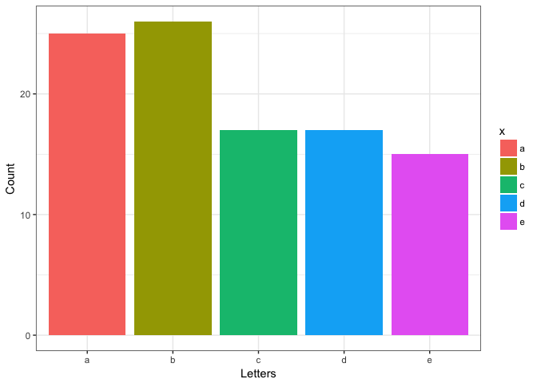

<!-- README.md is generated from README.Rmd. Please edit that file -->
foofactors
==========

Factors are a very useful type of variable in R, but they can also drive you nuts. This package provides some helper functions for the care and feeding of factors. This package is built based on [Jenny's foofactors package](http://stat545.com/packages06_foofactors-package.html).

-   Functions Jenny wrote: `fbind()` and `freq_out()`. Originally, there was no test for `freq_out()`, so I add some tests for it.

-   I added two more functions `fdetect()` and `fbarplot()` with tests. Please scroll down to the bottom for description and examples of these two functions.

-   [`fdetect.R`](https://github.com/yidie/Rpackage_foofactors/blob/master/R/fdetect.R) and [`test_fdetect.R`](https://github.com/yidie/Rpackage_foofactors/blob/master/tests/testthat/test_fdetect.R)

-   [`fbarplot.R`](https://github.com/yidie/Rpackage_foofactors/blob/master/R/fbarplot.R) and [`test_fbarplot.R`](https://github.com/yidie/Rpackage_foofactors/blob/master/tests/testthat/test_fbarplot.R)

-   My process report and issue opened for reviews are [here](https://github.com/yidie/STAT545-hw-Feng-Yidie/issues/9).

Installation
------------

You can install foofactors from github with:

``` r
# install.packages("devtools")
devtools::install_github("yidie/Rpackage_foofactors")
```

Example
-------

### Functions Jenny wrote

Binding two factors via `fbind()`:

``` r
library(foofactors)
a <- factor(c("character", "hits", "your", "eyeballs"))
b <- factor(c("but", "integer", "where it", "counts"))
```

Simply catenating two factors leads to a result that most don't expect.

``` r
c(a, b)
#> [1] 1 3 4 2 1 3 4 2
```

The `fbind()` function glues two factors together and returns factor.

``` r
fbind(a, b)
#> [1] character hits      your      eyeballs  but       integer   where it 
#> [8] counts   
#> Levels: but character counts eyeballs hits integer where it your
```

Often we want a table of frequencies for the levels of a factor. The base `table()` function returns an object of class `table`, which can be inconvenient for downstream work. Processing with `as.data.frame()` can be helpful but it's a bit clunky.

``` r
set.seed(1234)
x <- factor(sample(letters[1:5], size = 100, replace = TRUE))
table(x)
#> x
#>  a  b  c  d  e 
#> 25 26 17 17 15
as.data.frame(table(x))
#>   x Freq
#> 1 a   25
#> 2 b   26
#> 3 c   17
#> 4 d   17
#> 5 e   15
```

The `freq_out()` function returns a frequency table as a well-named `tbl_df`:

``` r
freq_out(x)
#> # A tibble: 5 x 2
#>        x     n
#>   <fctr> <int>
#> 1      a    25
#> 2      b    26
#> 3      c    17
#> 4      d    17
#> 5      e    15
```

### New Function \#1

When a dataframe is read into R, the character vector in the dataframe will be treated as factors automatically sometimes if you don't specify certain arguments in `read...()`. We want to differentiate characters from real factors.

The `fdetect()` function detects factors that should be character. It returns `TURE` if the input is indeed a factor, `FALSE` if it is a character:

``` r
fdetect(a)
#> [1] FALSE
fdetect(iris$Species)
#> [1] TRUE
```

### New Function \#2

We often need a bar plot to visualize categorical data. The `fbarplot()` function makes use of `freq_out()` and creates the bar plot of a factor with properly labelled axis, which is very handy:

``` r
fbarplot(x, xlabel="Letters")
```


